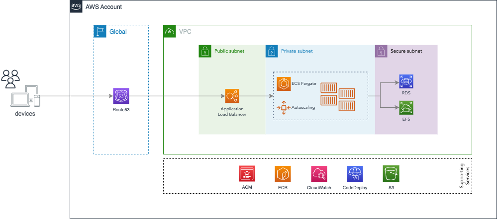

Wordpress

App URL: https://notdefined

```
# Account Number:  
# Region: ap-southeast-2
```

## Topology


## Local test: 

```
make build
make dev-up
```

## Remove local test: 

```
make dev-down
```

## CI Build
```
# Make any change on the repository and push to "main" branch  
```
or  
```
# Click on Actions -> CI-BUILD -> "Run workflow" and select the new branch created
```
## CI Deploy

```
Click on Actions -> CI-DEPLOY -> "Run workflow"
```
or
```
Click on Actions -> CI-DEPLOY -> "Run workflow" and insert a previous short commit SHA
```

#
